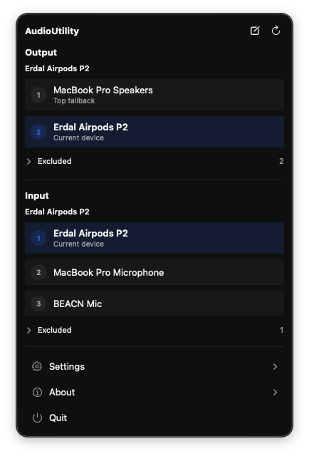
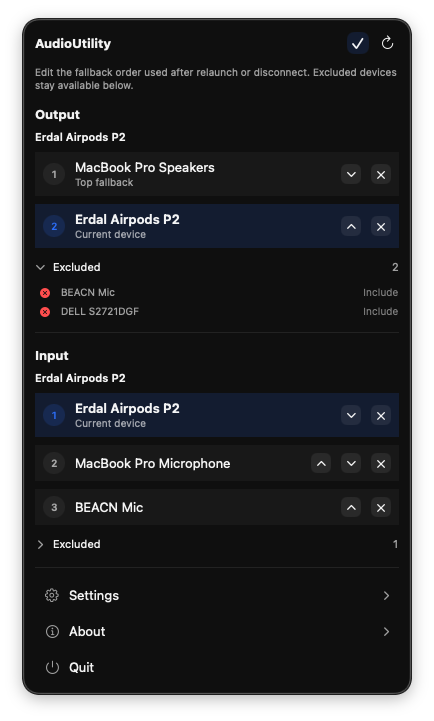

# AudioUtility

AudioUtility is a native macOS menu bar app for quickly switching the system’s default input and output audio devices without opening System Settings. It stays lightweight while still giving you persistent fallback ordering, excluded devices, onboarding, Open at Login setup, and in-app updates.

<table>
  <tr>
    <td width="50%">
      
    </td>
    <td width="50%">
      
    </td>
  </tr>
</table>

<p align="center"><em>The menu bar window for fast device switching, fallback ordering, and settings.</em></p>

## Features

- Native macOS app built with SwiftUI and CoreAudio
- Menu bar-first interface with a compact window-style panel for both output and input devices
- One-click switching for the current device selection
- Persistent fallback ordering and excluded devices, managed inline in edit mode
- Automatic refresh when devices appear, disappear, or system defaults change
- Remembered known devices so disconnected hardware can stay in your saved order
- First-launch onboarding and Open at Login setup
- Sparkle update support for direct release builds
- Minimal footprint with no tracking or telemetry

## How It Works

- Click a device to use it immediately for the current app run.
- Use edit mode to reorder fallback priority or exclude devices you do not want AudioUtility to choose automatically.
- On relaunch, reconnect, or when the current device disappears, AudioUtility falls back to the highest available device in your saved order.

## Install

### Requirements

- macOS that supports the current release build
- Permission to control your own login-item settings if you want Open at Login enabled

### Install from release

1. Download the latest `AudioUtility.zip` from [Releases](https://github.com/erdaltoprak/AudioUtility/releases/latest).
2. Unzip the archive.
3. Move `AudioUtility.app` to `/Applications`.
4. Launch the app and complete onboarding.

### Install from Homebrew

```bash
brew tap erdaltoprak/tap
brew install --cask erdaltoprak/tap/audioutility
```

Homebrew installs the same app bundle into `/Applications`.

### Updates

- Release installs use Sparkle for in-app updates.
- Homebrew installs use the same app bundle and are marked as self-updating in the tap.
- Manual update checks are available from the app menu and from the menu bar Settings popover.

## Getting Started For Development

### Requirements

- macOS with an Xcode toolchain that supports the project deployment target
- Xcode
- An Apple Developer account configured in Xcode if you want to test signed release builds

### Steps

1. Clone the repository.
2. Open `AudioUtility/AudioUtility.xcodeproj` in Xcode.
3. Select the `AudioUtility` scheme and a Mac run destination.
4. Build and run.
5. Use a Developer ID-signed release build, not an Xcode debug run, if you want to test Sparkle end to end.

The app is configured as a menu bar utility, so after onboarding it normally lives in the menu bar instead of behaving like a regular windowed app.

## Project Structure

```text
AudioUtility/
├── README.md
├── Docs/                  # architecture notes and appcast
├── Assets/                # repository images used in docs
└── AudioUtility/
    ├── AudioUtility.xcodeproj
    └── AudioUtility/
        ├── App/           # app entry, onboarding, login item, updater
        ├── Audio/         # models, preferences, services, store
        └── Features/      # menu bar content, settings, and about popovers
```

## License

See [License](./LICENSE.md).
